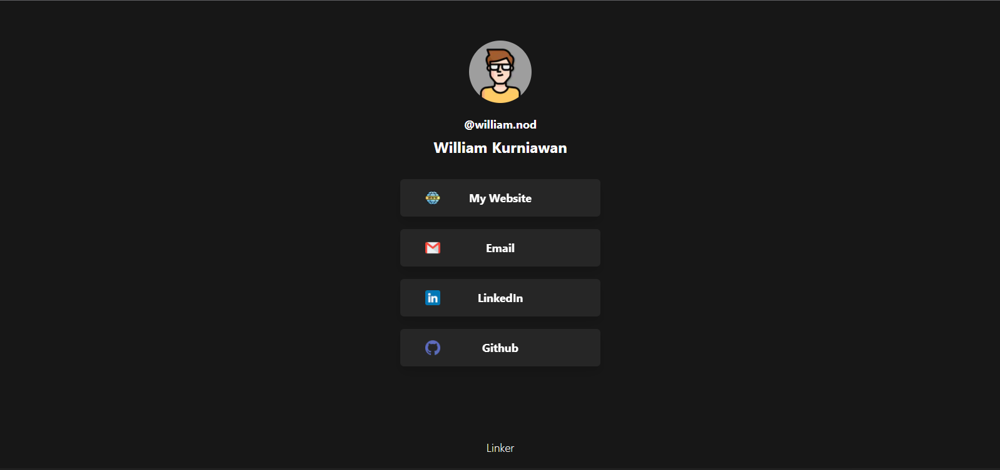
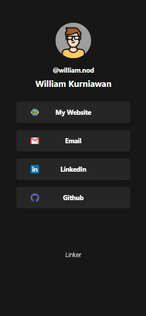

This is a [Next.js](https://nextjs.org/) project bootstrapped with [`create-next-app`](https://github.com/vercel/next.js/tree/canary/packages/create-next-app).

## Getting Started

First, run the development server:

```bash
npm run dev
# or
yarn dev
```

Open [http://localhost:3000](http://localhost:3000) with your browser to see the result. You can start editing the page by modifying `pages/index.js`.

# Linker

This app is imitation of bio.link and linktr.ee that build on top of next.js framework and tailwind for styling. You can fork or clone this repo and install all needed npm module with

`npm install`

After that you can edit the links, color, background, or anything 😎. Feel free to open pull request or issue 👍. Below you can see the preview of the app.
##


<center>
  
  
</center>
